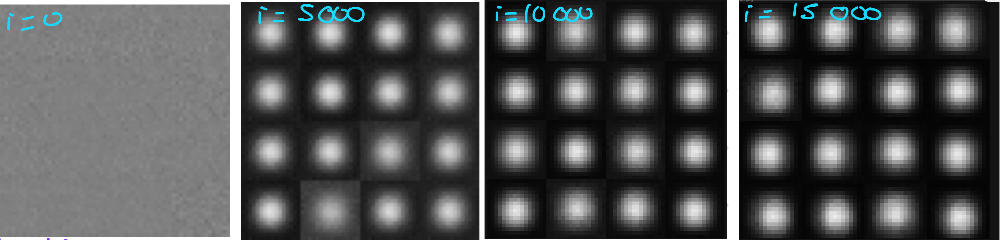

# VAE from Scratch in C++

A beginner friendly yet rigorous implementation of a **Variational Autoencoder (VAE)** built **from scratch in C++ **. The goal is to learn the math and the engineering by implementing the critical pieces (tensors, tiny autograd, losses, optimizer)
> **Why this repo exists**
>
> * Many tutorials jump straight to big frameworks. Here i will actually implement the building blocks.
> * Scope is at first intentionally small (MLP + 16×16 grayscale shapes) so i get results fast and learn deeply.
> * Clean milestones + tests keep you from dead-ends and rewrites.

## Roadmap  -> until now :

### Milestone A — The basics until the Plain Autoencoder
Goal: Make sure your model learns something — i.e., that loss decreases and reconstructions look like input shapes.

1. Training loop

Generate one batch of shape data 

Run forward prop, backprop and update weights.

Print loss every N iterations.

👉 Watch if loss decreases over iterations.
If it doesn’t, check for:

exploding or vanishing gradients (too large/small weights),

overly small learning rate.

2. Reconstruction visualization

Every ~500 iterations:

Run the current model on a few samples.

Save predicted output as PNG.

Compare input and reconstruction visually.

3. The actual model : 
X(input) -> Z -> H(latent space) -> Z2 -> A2 -> Y(output) -> sigmoid
Z = XW1 + b1
H = tanh(Z)
Z2 = HW2 + b2
A2 = tanh(Z2)
Y = A2W3+b3

sizes of the Matrixes / vectors : 
H = # features, D = # pixels, B = batch size
X (BxD)
Z (BxH)
H (BxH)
Z2 (BxH)
A2 (BxH)
Y (BxD)
W1 (DxH)
b1 (1xH)
W2 (HxH)
b2 (1xH)
W3 (HxD)
b3 (1xD)

Results : 

